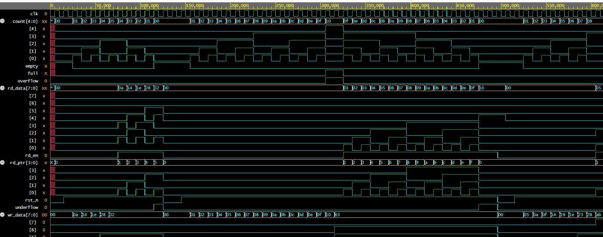
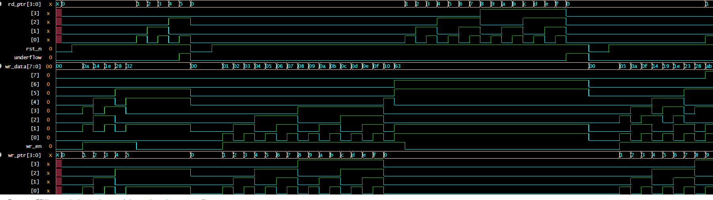

# Synchronous FIFO — RTL Design & Verification


---

## Table of Contents
1. [Project Overview](#project-overview)
2. [Specifications](#specifications)
3. [Architecture](#architecture)
4. [File Structure](#file-structure)
5. [Port List](#port-list)
6. [Simulation Results](#simulation-results)
7. [Waveform Analysis](#waveform-analysis)
8. [Interview Questions](#interview-questions)
9. [Common Mistakes](#common-mistakes)
10. [How to Run](#how-to-run)

---

## Project Overview

A parameterized **Synchronous FIFO** (First In First Out) buffer designed and verified using industry-standard RTL methodology.

Both write and read ports share a **single clock domain**. The design uses a **counter-based** full/empty detection scheme with a circular buffer memory array.

### Key Features
- Parameterized data width and depth
- Full and Empty status flags
- Overflow and Underflow error detection
- Combinational read output (zero read latency)
- Self-checking testbench with 8 test cases
- SystemVerilog Assertions (SVA) — 8 protocol checks
- Functional Coverage — 5 covergroups

---

## Specifications

| Parameter      | Value                     |
|----------------|---------------------------|
| Data Width     | 8 bits (parameterized)    |
| FIFO Depth     | 16 entries (parameterized)|
| Clock Domains  | 1 (Synchronous)           |
| Reset Type     | Active-Low, Synchronous   |
| Full Flag      | Combinational             |
| Empty Flag     | Combinational             |
| Overflow Flag  | Combinational pulse       |
| Underflow Flag | Combinational pulse       |
| Read Output    | Combinational (zero-latency) |

---

## Architecture

### Block Diagram

```
              ┌──────────────────────────────────────────────┐
              │              SYNCHRONOUS FIFO                │
              │                                              │
  clk    ────►│                                              │
  rst_n  ────►│  ┌────────────────────────────────────────┐ │
              │  │       MEMORY ARRAY  [16 × 8-bit]       │ │
  wr_en  ────►│  │                                        │ ├──► rd_data[7:0]
  wr_data────►│──►  mem[wr_ptr]  ───────►  mem[rd_ptr]  ─┤ │   (combinational)
              │  └──────────┬─────────────────────┬───────┘ │
  rd_en  ────►│             │                     │         ├──► full
              │         wr_ptr[3:0]           rd_ptr[3:0]  ├──► empty
              │             │                     │         ├──► overflow
              │             └──────────┬──────────┘         ├──► underflow
              │                        ▼                    │
              │                  count[4:0]                 │
              │           (0=empty, 16=full)                │
              └──────────────────────────────────────────────┘
```

### Design Decisions

| Decision | Choice | Reason |
|----------|--------|--------|
| Full/Empty detection | Counter-based | Simpler for single-clock domain. Gray-code only needed for async FIFO |
| Read output | Combinational (`assign rd_data = mem[rd_ptr]`) | Zero read latency |
| Pointer wrap | 4-bit natural overflow | 1111+1=0000 automatically — no extra logic |
| Count width | 5 bits | Must hold 0 to 16 (17 states — 4 bits not enough) |
| Reset | Synchronous, active-low | Industry standard for ASIC |
| Memory reset | Not reset | Only ptrs/count reset; `empty` prevents garbage reads |

---

## File Structure

```
sync_fifo/
├── rtl/
│   └── sync_fifo.sv          # Synthesizable RTL design
├── tb/
│   ├── tb_sync_fifo.sv       # Self-checking testbench (8 tests)
│   └── sync_fifo_sva.sv      # SystemVerilog Assertions (8 checks)
├── coverage/
│   └── sync_fifo_coverage.sv # Functional coverage (5 covergroups)
├── docs/
│   └── (add waveform screenshots here)
├── .gitignore
└── README.md
```

---

## Port List

| Port       | Dir    | Width  | Description                    |
|------------|--------|--------|--------------------------------|
| `clk`      | input  | 1      | System clock                   |
| `rst_n`    | input  | 1      | Active-low synchronous reset   |
| `wr_en`    | input  | 1      | Write enable                   |
| `rd_en`    | input  | 1      | Read enable                    |
| `wr_data`  | input  | [7:0]  | Data to write into FIFO        |
| `rd_data`  | output | [7:0]  | Data read from FIFO (combo)    |
| `full`     | output | 1      | FIFO is full (count == 16)     |
| `empty`    | output | 1      | FIFO is empty (count == 0)     |
| `overflow` | output | 1      | Write attempted when full      |
| `underflow`| output | 1      | Read attempted when empty      |

### Internal Signals

| Signal   | Width  | Description                        |
|----------|--------|------------------------------------|
| `mem`    | 16×8   | Circular buffer memory array       |
| `wr_ptr` | [3:0]  | Write pointer — next write address |
| `rd_ptr` | [3:0]  | Read pointer  — next read address  |
| `count`  | [4:0]  | Number of valid entries (0 to 16)  |

---

## Simulation Results

### Test Summary

| # | Test Case                    | Result  |
|---|------------------------------|---------|
| 1 | Reset behavior               | ✅ PASS |
| 2 | Basic write then read (order)| ✅ PASS |
| 3 | Fill FIFO to full            | ✅ PASS |
| 4 | Overflow detection           | ✅ PASS |
| 5 | Drain FIFO to empty          | ✅ PASS |
| 6 | Underflow detection          | ✅ PASS |
| 7 | Simultaneous read + write    | ✅ PASS |
| 8 | Corner: almost-full R+W      | ✅ PASS |

### SVA Assertions

| Assertion              | Checks                              | Status |
|------------------------|-------------------------------------|--------|
| A_OVERFLOW             | Overflow fires on write when full   | ✅     |
| A_UNDERFLOW            | Underflow fires on read when empty  | ✅     |
| A_FULL_EMPTY_MUTEX     | Full and empty never both high      | ✅     |
| A_RESET_STATE          | FIFO empty one cycle after reset    | ✅     |
| A_COUNT_MAX            | Count never exceeds DEPTH           | ✅     |
| A_FULL_CORRECT         | Full asserted when count == DEPTH   | ✅     |
| A_EMPTY_CORRECT        | Empty asserted when count == 0      | ✅     |
| A_NO_SPURIOUS_OVERFLOW | Overflow only when actually full    | ✅     |

### Functional Coverage

| Covergroup          | Coverage |
|---------------------|----------|
| Fill Level          | 100%     |
| Operation Types     | 100%     |
| Error Conditions    | 100%     |
| Cross Coverage      | 100%     |
| Data Patterns       | 100%     |
| **Total**           | **100%** |

---

## Waveform Analysis

> Full waveform analysis: [docs/waveform_analysis.md](docs/waveform_analysis.md)

### Simulation Waveforms (EPWave — EDA Playground)

**Full Overview — All Signals**


**Pointer & Data Detail — wr_ptr, rd_ptr, wr_data, wr_en**


### Phase 1 — Reset
```
rst_n:  0 ──────────► 1
count:  X ──────────► 00   (cleared)
empty:  X ──────────► 1    (FIFO starts empty)
ptrs:   X ──────────► 0    (both pointers reset)
```

### Phase 2 — Write 5 Values (Test 2)
```
wr_data:  0x0A → 0x14 → 0x1E → 0x28 → 0x32
           (10)    (20)    (30)    (40)    (50)
count:     00  →   01  →   02  →   03  →   04  →  05
wr_ptr:     0  →    1  →    2  →    3  →    4  →   5
```

### Phase 3 — Read 5 Values Back (FIFO order verified ✅)
```
rd_data:  0x0A → 0x14 → 0x1E → 0x28 → 0x32
           (10)    (20)    (30)    (40)    (50)
           ↑ Exact same order as written — FIFO confirmed!
count:     05  →  04  →  03  →  02  →  01  →  00
empty:  asserts immediately when count = 0
```

### Phase 4 — Fill to Full (Test 3)
```
count:  00→01→02→...→0E→0F→10  (0 to 16)
full:   ________________________/‾‾‾‾ asserts at count=0x10
wr_ptr: 0→1→2→...→E→F→0  ← WRAP-AROUND at F→0 (natural 4-bit overflow)
```

### Phase 5 — Overflow Pulse (Test 4)
```
full:       ‾‾‾‾‾‾‾‾‾‾‾‾‾‾‾
wr_en:      ___/‾\__________
overflow:   ___/‾\__________  ← 1-cycle pulse only
count:      stays at 0x10 (write safely blocked)
wr_ptr:     does NOT advance (memory protected)
```

### Phase 6 — Drain to Empty (Test 5)
```
rd_data:  0x01→0x02→...→0x0F→0x10  (reads 1 to 16 in order ✅)
count:    10→0F→0E→...→01→00
rd_ptr:    0→ 1→ 2→...→ F→ 0  ← wraps back to 0
empty:  asserts when count = 0x00
```

### Phase 7 — Underflow Pulse (Test 6)
```
empty:      ‾‾‾‾‾‾‾‾‾‾‾‾‾‾
rd_en:      ___/‾\__________
underflow:  ___/‾\__________  ← 1-cycle pulse
rd_ptr:     does NOT advance (protected)
```

### Phase 8 — Simultaneous Read+Write (Test 7)
```
wr_en=1, rd_en=1 at same clock edge:
  count:   UNCHANGED (one in, one out)
  wr_ptr:  advances +1
  rd_ptr:  advances +1
  No data loss, no corruption ✅
```

### Key Waveform Observations
- **X-states before reset:** Correct — no accidental RTL initialization
- **Pointer wrap-around:** Both `wr_ptr` and `rd_ptr` visibly wrap F→0
- **Combinational `rd_data`:** Changes without waiting for clock edge
- **count bit[4]:** Goes high ONLY at count=16 — confirms 5-bit necessity
- **Flag timing:** `full` and `empty` are purely combinational — same-cycle response

---

## Interview Questions

### Design
1. What is the difference between synchronous and asynchronous FIFO?
2. Why does `count` need 5 bits for a 16-deep FIFO?
3. How does 4-bit pointer wrap-around work without extra logic?
4. What is the difference between `full` and `overflow`?
5. What happens when `wr_en` and `rd_en` are asserted simultaneously?
6. Why don't we reset the memory array?

### Verification
1. What is a self-checking testbench?
2. What is `===` vs `==` in SystemVerilog?
3. What does `disable iff (!rst_n)` do in an SVA?
4. What is the difference between code coverage and functional coverage?
5. What is cross coverage and why is it needed?
6. What is a scoreboard?

### Coding
1. Why use non-blocking `<=` in sequential blocks?
2. Why use `$clog2` instead of hardcoded widths?
3. What would go wrong with blocking `=` in a clocked block?

---

## Common Mistakes (Freshers)

| Mistake | Fix |
|---------|-----|
| Using `=` in `always @(posedge clk)` | Always use `<=` (non-blocking) |
| 4-bit count for DEPTH=16 | Need 5 bits — count holds 0 to 16 |
| Resetting `mem` array | Don't — only reset ptrs and count |
| Checking overflow after `wr_en` drops | Sample while `wr_en` is still high |
| Combinational check in clocked block | Separate flags with `assign` |
| Forgetting simultaneous R+W case | Count stays same — handle explicitly |

---

## How to Run

### EDA Playground (Free Online)
1. Go to [edaplayground.com](https://edaplayground.com)
2. Paste `rtl/sync_fifo.sv` in the **Design** panel
3. Paste `tb/tb_sync_fifo.sv` in the **Testbench** panel
4. Select **Aldec Riviera-PRO** or **Cadence Xcelium**
5. Enable **SystemVerilog** checkbox
6. Check **Open EPWave after run**
7. Click **Run** ▶

### Expected Output
```
========================================
   SYNC FIFO — SELF-CHECKING TESTBENCH
========================================
--- TEST 1: Reset Behavior ---
  RESULT: PASS ✅
--- TEST 2: Basic Write then Read ---
  [READ ] got=0x0a expected=0x0a — PASS
  ...
ALL TESTS PASSED ✅  Errors = 0
========================================
```

---

## Author

**SHARANMAYYA6070**
- Project: Parameterized Synchronous FIFO
- Language: SystemVerilog
- Tool: EDA Playground
- Methodology: Industry RTL Design & Verification Workflow
- Date: July 2026
